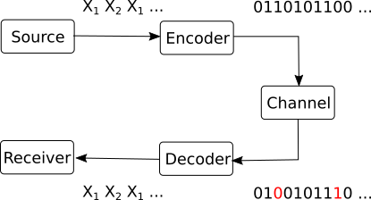
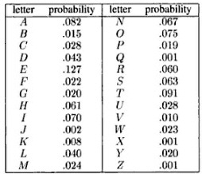
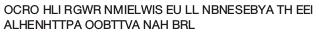
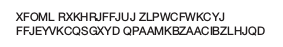
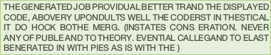
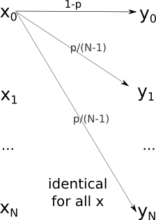
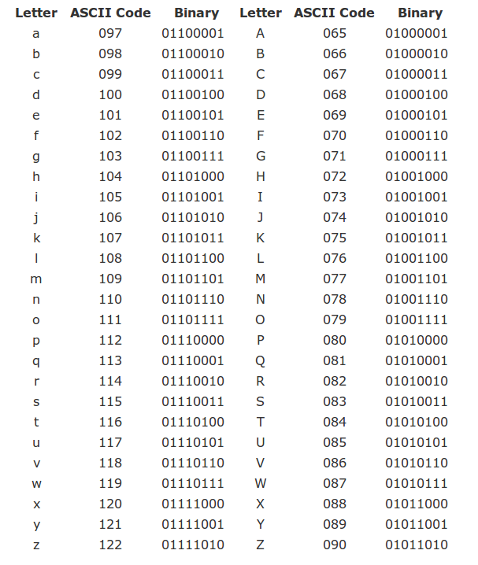
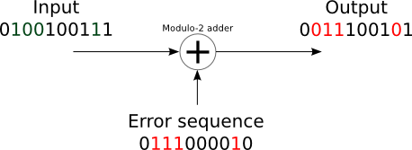
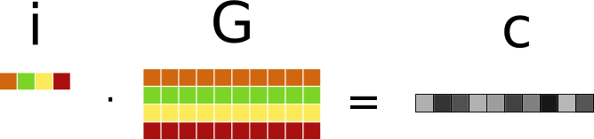
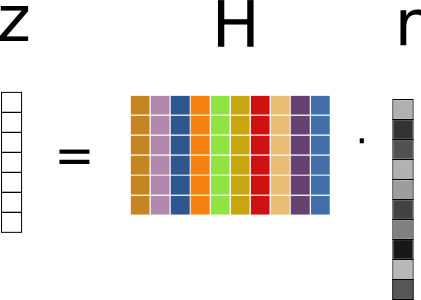

# Lecture notes 2015-2016

## Introduction

### Organization
Professors:

* Lectures: Nicolae Cleju
* Laboratories: Daniel Matasaru

### Grades
Final grade = 0.75 Exam + 0.25 Lab

### Time schedule
* 14 weeks of lectures (3h each)
* 14 weeks of laboratories (2h each)
* Office hours: by appointment

### Course structure
1. Chapter I:   Discrete Information Sources
2. Chapter II:  Discrete Transmission Channels
3. Chapter III: Source Coding
4. Chapter IV:  Channel Coding 

### Bibliography

1. ***Elements of Information Theory*, Valeriu Munteanu, Daniela Tarniceriu, Ed. CERMI 2007**
1. *Elements of Information Theory*, Thomas M. Cover, Joy A. Thomas, 2nd Edition, Wiley 2006
1. *Information and Coding Theory*, Gareth A. Jones, J. Mary Jones, Springer 2000
1. *Transmisia si codarea informatiei*, lectures at ETTI (Romanian)

## Introduction to probabilities

### Basic notions of probability
* Random variable = the outcome of an experiment 

* Distribution (probability mass function)

* Discrete distribution

* Alphabet

* Logarithm function

* Exponential function

* Average of some values

### Basic properties
* Two independent events: $$p(A \cap B) = p(A) \cdot p(B)$$

## Chapter I: Discrete information sources

### Block diagram of a communication system

{width=50%}

### What is information?

Example:

* I tell you the following sentence: "your favorite football team lost the last match".

* Does this message carry information? How, why, how much?

* Consider the following facts:

    * the message carries information only because you didn't already know the result.
    * if you already known the result, the message is useless (brings no information)
    * since you didn't know the result, there were multiple results possible (win, equal or lose)
    * the actual information in the message is that *lost* happened, and not *win* or *equal*
    * if the result was to be expected, there is little information. If the result
is highly unusual, there is more information in this message

### Information source

* We will always consider information in a context similar to the above example.

* We will use terminology from probability theory to define information:

    * there is a *probabilistic source* that can produce a number of different *events*.
    * each event has a certain probability. We know all the probabilities beforehand.
    * at one time, an event is randomly selected according to its probability.
    * afterwards, a new message can be selected, and so on ==> a stream of messages is produced.

* The source is called an *information source* and the selected event is a *message*.

* A message carries the information that **it** happened, and not the other possible message events that could have been selected.

* The quantity of information is dependent in its probability.

### Discrete memoryless source

* A discrete memoryless source (DMS) is an information source where the messages are **independent** , i.e. the choice of a message
at one time does not depend on what were the previous messages

* Each message has a fixed probability. The set of probabilities is the *distribution* of the source.

$$\sIII{S}{\fIoII}{\fIoIV}{\fIoIV}$$

* Properties:

    * Discrete: it can take a value from a discrete set (alphabet)
    * Complete: $\sum p(s_i) = 1$
    * Memoryless: succesive values are independent of previous values (e.g. successive throws of a coin)

* A message from a DMS is also called a *random variable* in probabilistics.

### Examples
* A coin is a discrete memoryless source (DMS) with two messages:
$$\snII{S}{heads}{\fIoII}{tails}{\fIoII}$$

* A dice is a discrete memoryless source (DMS) with six messages:
$$\sVI{S}{\fIoVI}{\fIoVI}{\fIoVI}{\fIoVI}{\fIoVI}{\fIoVI}$$

* Playing the lottery can be modeled as DMS:
$$\sII{S}{0.9999}{0.0001}$$

### Examples

* An extreme type of DMS containing the certain event:
$$\sII{S}{1}{0}$$

* Receiving an unknown *bit* (0 or 1) with equal probabilities:
$$\snII{S}{0}{\fIoII}{1}{\fIoII}$$

### Information 
* When a DMS provides a new message, it gives out some new information, i.e. the
information that a particular message took place.

* The information attached to a particular event (message) is rigorously defined as:
$$i(s_i) = -\log_2(p(s_i))$$

* Properties:

    * $i(s_i) \geq 0$
    * lower probability (rare events) means higher information
    * higher probability (frequent events) means lower information
    * a certain event brings no information: $-\log(1) = 0$
    * an event with probability 0 brings infinite information (but it never happens..)

### Entropy of a DMS

* We usually don't care about a single message. We are interested in a large number of them
(think millions of bits of data).

* We are interested in the *average* information of a message from a DMS.

* Definition: the entropy of a DMS source $S$ is **the average information of a message**:
$$H(S) = \sum_{k} p_k i(s_k) = -\sum_{k} p_k \log_2(p_k)$$
where $p_k = p(s_k)$  is the probability of message $k$.

### The choice of logarithm

* Any base of logarithm can be used in the definition.

* Usual convention: use binary logarithm $\log_2()$. H(S) measured in *bits* (*bits / message*)

* If using natural logarithm $ln()$, H(S) is measured in $nats$.

* Logarithm bases can be converted to/from one another:
$$ \log_b(x) = \frac{\log_a(x)}{\log_a(b)} $$

* Entropies using different logarithms differ only in scaling:
$$ H_b(S) =\frac{H_a(S)}{\log_a(b)}  $$

### Examples

* Coin: $H(S) = 1 bit/message$
* Dice: $H(S) = \log(6) bits/message$
* Lottery: $H(S) = -0.9999 \log(0.9999) - 0.0001 \log(0.0001)$
* Receiving 1 bit: $H(S) = 1 bit/message$ (hence the name!)

### Interpretation of the entropy

All the following interpretations of entropy are true:

* H(S) is the *average uncertainty* of the source S

* H(S) is the *average information* of messages from source S

* A long sequence of $N$ messages from $S$ has total information $\approx N \cdot H(S)$

* H(S) is the minimum number of bits (0,1) required to uniquely represent an average message 
from source S

### Properties of entropy

We prove the following **properties of entropy**:

1. $H(S) \geq  0$ (non-negative)

2. $H(S)$ is maximum when all $n$ messages have equal probability $\frac{1}{n}$.
The maximum value is $\max H(S) = \log(n)$.

3. *Diversfication* of the source always increases the entropy

### The entropy of a binary source

* Consider a general DMS with two messages:
$$\sII{S}{p}{1-p}$$

* It's entropy is:
$$H(S) = -p \cdot \log(p) - (1-p) \cdot \log(1-p)$$

* Graphical plot...

### Example - Game
Game: I think of a number between 1 and 8. You have to guess it by asking
yes/no questions.

* How much uncertainty does the problem have?
* How is the best way to ask questions? Why?
* What if the questions are not asked in the best way?
* On average, what is the number of questions required to find the number?

### Example - Game v2
* Suppose I choose a number according to the following distribution:
$$\sIV{S}{\fIoII}{\fIoIV}{\fIoVIII}{\fIoVIII}$$

    * On average, what is the number of questions required to find the number? 
    * What questions would you ask?

* What if the distribution is:
$$\sIV{S}{0.14}{0.29}{0.4}{0.17}$$

* In general:

    * What distribution makes guessing the number the most difficult?
    * What distribution makes guessing the number the easiest?

### Information flow of a DMS

* Suppose that message $s_i$ takes time $t_i$ to be transmitted via some channel.

* Definition: the information flow of a DMS $S$ is **the average information transmitted
per unit of time**:
$$H_\tau(S) = \frac{H(S)}{\overline{t}}$$
where $\overline{t}$ is the average duration of transmitting a message:
$$\overline{t} = \sum_{i} p_i t_i $$

### Extended DMS

* Definition: the $n$-th order extension of a DMS $S$, $S^n$ is the source with
messages has as messages all the combinations of $n$ messages of $S$:
$$\sigma_i = \underbrace{s_j s_k ... s_l}_{n}$$

* If $S$ has $k$ messages, $S^n$ has $k^n$ messages
* Since $S$ is DMS $$p(\sigma_i) = p(s_j) \cdot p(s_k) \cdot ... \cdot p(s_l)$$

### Extended DMS - Example

* Examples:
$$\sII{S}{\fIoIV}{\frac{3}{4}}$$
$$\snIV{S^2}{\sigma_1 = s_1 s_1}{\frac{1}{16}}{\sigma_2 = s_1 s_2}{\frac{3}{16}}{\sigma_3 = s_2 s_1}{\frac{3}{16}}{\sigma_4 = s_2 s_2}{\frac{9}{16}}$$
$$S^3: \left( \begin{matrix} s_1 s_1 s_1 & s_1 s_1 s_2 & s_1 s_2 s_1 & s_1 s_2 s_2 & s_2 s_1 s_1 & s_2 s_1 s_2 & s_2 s_2 s_1 & s_2 s_2 s_2 \\ ... & ... & ... & ... & ... & ... & ... & ... \end{matrix} \right)$$

### Extended DMS - Another example
* Long sequence of binary messages:
$$0 1 0 0 1 1 0 0 1 1 1  0 0 1 0 1 0 0 ...$$

    * Can be grouped in bits, half-bytes, bytes, 16-bit words, 32-bit long words, and so on.

### Property of DMS

* Theorem: The entropy of a $n$-th order extension is $n$ times larger than the entropy of the original DMS
$$H(S^n) = n H(S)$$

* Interpretation: grouping messages from a long sequence in blocks of $n$ does not change total information
(e.g. groups of 8 bits = 1 byte)

### An example [memoryless is not enough]

* The distribution (frequencies) of letters in English:

{width=30%}\ 

* Text from a memoryless source with these probabilities:

{width=50%}\

*(taken from Elements of Information Theory, Cover, Thomas)*

* What's wrong? **Memoryless**

### Sources with memory

* **Definition**: A source has memory of order $m$ if the probability
of a message depends on the last $m$ messages.

* The last $m$ messages = the **state** of the source ($S_i$).

* A source with $n$ messages and memory $m$ => $n^m$ states in all.

* For every state, messages can have a different set of
probabilities. Notation: $p(s_i | S_k)$ = *"probability of $s_i$ in state $S_k$"*.

* Also known as *Markov sources*.

### Example
* A source with $n=4$ messages and memory $m=1$

    * if last message was $s_1$, choose next message with distribution
$$\sIV{S_1}{0.4}{0.3}{0.2}{0.1}$$
    * if last message was $s_2$, choose next message with distribution
$$\sIV{S_2}{0.33}{0.37}{0.15}{0.15}$$
    * if last message was $s_3$, choose next message with distribution
$$\sIV{S_3}{0.2}{0.35}{0.41}{0.04}$$
    * if last message was $s_4$, choose next message with distribution
$$\sIV{S_4}{0.1}{0.2}{0.3}{0.4}$$

### Transitions

* When a new message is provided, the source **transitions** to a
new state:
$$\underbrace{s_i s_j s_k}_{\text{old state}} s_l$$
$$s_i \underbrace{s_j s_k s_l}_{\text{new state}}$$

* The message probabilities = the probabilities of transitions from
some state $S_u$ to another state $S_v$

### Transition matrix
* The transition probabilities are organized in a **transition
matrix** $[T]$
$$[T] = 
\begin{bmatrix}
p_{11} & p_{12} & ... & p_{1N} \\ 
p_{21} & p_{22} & ... & p_{2N} \\ 
... & ... & ... & ... \\ 
p_{N1} & p_{N2} & ... & p_{NN} \\ 
\end{bmatrix}$$

* $p_{ij}$ is the transition probability from state $S_i$ to state
$S_j$

* $N$ is the total number of states

### Graphical representation
Example here

### Entropy of sources with memory
* Each state $S_k$ has a different distribution --> each state has a different entropy $H(S_k)$
$$H(S_k) = - \sum_i p(s_i | S_k) \cdot \log(p(s_i | S_k))$$

* Global entropy = average entropy
$$H(S) = \sum_k p_k H(S_k)$$
where $p_k$ = probability that the source is in state $S_i$
(i.e. after a very long sequence of messages, how many times the source was in state $S_k$)

### Ergodic sources

* Let $p_i^{(t)} =$ the probability that source $S$ is in state $S_i$ at time $t$.

* In what state will it be at time $t+1$? (after one more message) (probabilities)

$[p_1^{(t)}, p_2^{(t)}, ... p_N^{(t)}] \cdot [T] = [p_1^{(t+1)}, p_2^{(t+1)}, ... p_N^{(t+1)}]$

* After one more message:

$[p_1^{(t)}, p_2^{(t)}, ... p_N^{(t)}] \cdot [T] \cdot [T] = [p_1^{(t+2)}, p_2^{(t+2)}, ... p_N^{(t+2)}]$

* In general, after $n$ messages the probabilities that the source is in a certain state are:

$[p_1^{(0)}, p_2^{(0)}, ... p_N^{(0)}] \cdot [T]^{n} = [p_1^{(n)}, p_2^{(n)}, ... p_N^{(n)}]$

### Ergodicity

* A source is called **ergodic** if every state can be reached from every state, in a finite number of steps.

**Property of ergodic sources:** 

* After many messages, the probabilities of the states *become stationary* (converge to some fixed values), irrespective of the initial probabilities.
$$\lim_{n \to \infty} [p_1^{(n)}, p_2^{(n)}, ... p_N^{(n)}] = [p_1, p_2, ... p_N]$$

### Finding the stationary probabilties

* After $n$ messages and after $n+1$ messages, the probabilties are the same:

$[p_1, p_2, ... p_N] \cdot [T] = [p_1, p_2, ... p_N]$

* Also $p_1 + p_2 + ... + p_N = 1$.

=> solve system of equations, find values.

### Entropy of ergodic sources with memory 

* The entropy of an ergodic source with memory is
$$H(S) = \sum_k p_k H(S_k) = - \sum_k p_k \sum_i p(s_i | S_k) \cdot \log(p(s_i | S_k)$$

### Example English text as sources with memory

*(taken from Elements of Information Theory, Cover, Thomas)*

* Memoryless source, equal probabilities:
{width=50%}\

* Memoryless source, probabilities of each letter as in English:
{width=50%}\

* Source with memory $m=1$, frequency of pairs as in English:
{width=50%}\

* Source with memory $m=2$, frequency of triplets as in English:
{width=50%}\

* Source with memory $m=3$, frequency of 4-plets as in English:
{width=50%}\

### Chapter summary

* Information of a message: $i(s_k) = -\log_2(p(s_k))$

* Entropy of a memoryless source: $H(S) = \sum_{k} p_k i(s_k) = -\sum_{k} p_k \log_2(p_k)$

* Properties of entropy:
    
    1. $H(S) \geq  0$

    2. Is maximum when all messages have equal probability ($H_{max}(S) = \log(n)$)

    3. *Diversfication* of the source always increases the entropy

* Sources with memory: definition, transitions

* Stationary probabilities of ergodic sources with memory:
$[p_1, p_2, ... p_N] \cdot [T] = [p_1, p_2, ... p_N]$, $\sum_i p_i = 1$.

* Entropy of sources with memory:
$$H(S) = \sum_k p_k H(S_k) = - \sum_k p_k \sum_i p(s_i | S_k) \cdot \log(p(s_i | S_k)$$

## Chapter II: Discrete Transmission Channels

### What are they?

{width=40%}

* A system of two related random variables

* Input random variable $X = {x_1, x_2, ...}$, output random variable $Y = {y_1, y_2, ...}$

* $X$ and $Y$ are *related*, but still *random* (usually because of *noise*)

### What do we want

* Successful communication: receive $Y$, deduce what was sent $X$
* We are interested in **deducing X when knowing Y**
* How much does knowing $Y$ tell us about $X$? 
    * Depends on the relation between them
    * Is the same as how much $X$ tells us about $Y$ (symmetrical)

### Nomenclature

* Discrete: the input alhabet and the output alphabet are finite
* Memoryless: the output symbol depends only on the current input symbol
* Stationary: the noise arising on the channel is time invariant (i.e.
its statistics do not vary in time)

### Systems of two random variables

* Two random variables: $X = {x_1, x_2, ...}$, $Y = {y_1, y_2, ...}$.
* Example: throw a dice (X) and a coin (Y) simultaneously
* How to describe this system?

A single joint information source:

$$\snIV{X \cap Y}{x_1 \cap y_1}{p(x_1 \cap y_1)}{x_1 \cap y_2}{p(x_1 \cap y_2)}{...}{...}{x_i \cap y_j}{p(x_i \cap y_j)}$$

Arrange in a nicer form (table):

              $y_1$              $y_2$    $y_3$ 
-----------   -----              -----    -----
$x_1$         ...                ...      ...
$x_2$         ...                ...      ...
$x_3$         ...                ...      ...

* Elements of the table: $p(x_i \cap y_j)$

### Joint probability matrix

The table constitutes the **joint probability matrix**:

$$ P(X,Y) = 
\begin{bmatrix}
p(x_1 \cap y_1) & p(x_1 \cap y_2) & \cdots & p(x_1 \cap y_M) \\ 
p(x_2 \cap y_1) & p(x_2 \cap y_2) & \cdots & p(x_2 \cap y_M) \\ 
\vdots & \vdots & \cdots & \vdots \\
p(x_N \cap y_1) & p(x_N \cap y_2) & \cdots & p(x_N \cap y_M) \\ 
\end{bmatrix} $$

$$\sum_i \sum_j p(x_i \cap y_j) = 1$$

* This matrix completely defines the two-variable system 
* This matrix completely defines the communication process

### Joint entropy

* The distribution $X \cap Y$ determines the **joint entropy**:
$$H(X,Y) = - \sum_i \sum_j p(x_i \cap y_j) \cdot \log(p(x_i \cap y_j))$$

* This is the global entropy of the system (knowing the input and the output)

### Marginal distributions

* $p(x_i) = \sum_j p(x_i \cap y_j)$ = sum of row $i$ from P(X,Y)
* $p(y_j) = \sum_i p(x_i \cap y_j)$ = sum of column $j$ from P(X,Y)
* The distributions $p(x)$ and $p(y)$ are called **marginal distributions**
("summed along the margins")

### Examples [marginal distributions not enough]

* Example 1:

$$P(X,Y) = 
\begin{bmatrix}
0.3 & 0 \\ 
0 & 0.7 &
\end{bmatrix}$$

* Example 2:

$$P(X,Y) = 
\begin{bmatrix}
0.15 & 15 \\ 
0.15 & 0.55 
\end{bmatrix}$$

* Both have identical $p(x)$ and $p(y)$, but are completely different
* Which one is better for a transmission?
* Marginal distribution are useful, but not enough. Essential is the 
*relation* between X and Y.

### Bayes formula

$$p(A \cap B) = p(A) \cdot p(B | A)$$

$$p(B | A) = \frac{p(A \cap B)}{p(A)}$$

* "The conditional probability of B **given A** " (i.e. given that event A happened)

* Examples...

* Independence: 
$$p(A \cap B) = p(A) p(B)$$
$$p(B | A) = p(B)$$

### Channel matrix

Noise (or channel) matrix:

$$P(Y|X) =
\begin{bmatrix}
p(y_1 | x_1) & p(y_2 | x_1) & \cdots & p(y_M | x_1) \\ 
p(y_1 | x_2) & p(y_2 | x_2) & \cdots & p(y_M | x_2) \\ 
\vdots & \vdots & \cdots & \vdots \\
p(y_1 | x_N) & p(y_2 | x_N) & \cdots & p(y_M | x_N) \\
\end{bmatrix} $$

* Defines the probability of an output **given an input**
* Each row  = a separate distribution that indicates the probability of the outputs
**if the input is $x_i$**)

* The sum of each row is 1 (there must be some output if the input is $x_i$

### Relation of channel matrix and joint probability matrix

* $P(Y|X)$ is obtained from $P(X,Y)$ by dividing every row to its sum ($p(x_i)$)
* This is known as *normalization* of rows
* $P(X,Y)$ can be obtained back from $P(Y|X)$ by multiplying each row with $p(x_i)$
* $P(Y|X)$ contains less information than $P(X,Y)$

### Definition of a discrete transmission channel

**Definition**: A discrete transmission channel is defined by three items:

 1. The input alphabet $X = \{ x_1, x_2, \ldots \}$
 2. The output alphabet $Y = \{y_1, y_2, \ldots \}$
 3. The noise (channel) matrix $P(Y|X)$ which defines the conditional probabilities of 
 the outputs $y_j$ for every possible input $x_i$

### Graphical representation of a channel

* Nice picture with arrows :)

### Three examples 

Three examples to help you remember conditional probabilities

* Play and win the lottery

* Gambler's paradox

* CNN: [Crippled cruise ship returns; passengers happy to be back](http://edition.cnn.com/2013/02/14/travel/cruise-ship-fire/)

### Conditional entropy H(Y|X) (mean error)

* Since each row is a distribution, each row has an entropy
* Entropy of row $x_i$:
$$H(Y|x_i) = -\sum_j p(y_j|x_i) \log(p(y_j|x_i))$$
* *"The uncertainty of the output message when the input message is $x_i$"*
* Example: lottery

### Conditional entropy H(Y|X) (mean error)

* A different $H(Y|x_i)$ for every $x_i$
* Compute the average over all $x_i$:
$$\begin{aligned}
H(Y|X) &= \sum_i p(x_i) H(Y|x_i) \\
       &= -\sum_i \sum_j p(x_i) p(y_j|x_i) \log(p(y_j|x_i)) \\
       &= -\sum_i \sum_j p(x_i \cap y_j) \log(p(y_j|x_i))
\end{aligned}$$
* **"The uncertainty of the output message when we know the input message"** (any input, in general)

### Equivocation matrix

Equivocation matrix:

$$P(X|Y) =
\begin{bmatrix}
p(x_1 | y_1) & p(x_1 | y_2) & \cdots & p(x_1 | y_M) \\ 
p(x_2 | y_1) & p(x_2 | y_2) & \cdots & p(x_2 | y_M) \\ 
\vdots & \vdots & \cdots & \vdots \\
p(x_N | y_1) & p(x_N | y_2) & \cdots & p(x_N | y_M) \\
\end{bmatrix}$$

* Defines the probability of an input **given an output**
* Each column  = a separate distribution that indicates the probability of the inputs
**if the output is $y_j$**)

* The sum of each column is 1 (there must be some input if the output is $y_j$

### Relation of equivocation matrix and joint probability matrix

* $P(X|Y)$ is obtained from $P(X,Y)$ by dividing every column to its sum ($p(y_j)$)
* This is known as *normalization* of columns
* $P(X,Y)$ can be obtained back from $P(X|Y)$ by multiplying each column with $p(y_j)$
* $P(X|Y)$ contains less information than $P(X,Y)$

### Conditional entropy H(X|Y) (equivocation)

* Since each column is a distribution, each column has an entropy
* Entropy of column $y_j$:
$$H(X|y_j) = -\sum_i p(x_i|y_j) \log(p(x_i|y_j))$$
* *"The uncertainty of the input message when the output message is $y_j$"*
* Example: ...

### Conditional entropy H(X|Y) (equivocation)

* A different $H(X|y_j)$ for every $y_j$
* Compute the average over all $y_j$:
$$\begin{aligned}
H(X|Y) &= \sum_j p(y_j) H(X|y_j) \\
       &= -\sum_i \sum_j p(y_j) p(x_i|y_j) \log(p(x_i|y_j)) \\
       &= -\sum_i \sum_j p(x_i \cap y_j) \log(p(x_i|y_j))
\end{aligned}$$
* **"The uncertainty of the input message when we know the output message"** (any output, in general)
* Should be small for a good communication

### Properties of conditional entropies

For a general system with two random variables $X$ and $Y$:

* Conditioning always reduces entropy:
$$H(X|Y) \leq H(X)$$
$$H(Y|X) \leq H(Y)$$
(knowing something cannot harm)

* If the variables are independent:
$$H(X|Y) = H(X)$$
$$H(Y|X) = H(Y)$$
(knowing the second variable does not help at all)

### Mutual information I(X,Y)

* Mutual information I(X,Y) = the average information that one variable has about the other
* Mutual information I(X,Y) = the average information that is transmitted on the channel
* Consider a communication channel with $X$ as input and $Y$ as output:
    * We are the receiver and we want to find out the $X$
    * When we don't know the output: H(X)
    * When we know the output: H(X|Y)
* How much information was transmitted?
    * Reduction of uncertainty: 
    $$I(X,Y) = H(X) - H(X|Y)$$
    
### Mutual information I(X,Y)
$$\begin{aligned}
I(X,Y) &= H(X) - H(X|Y) \\
       &= -\sum_i p(x_i) \log(p(x_i)) + \sum_i \sum_j p(x_i \cap y_j) \log(p(x_i|y_j)) \\
       &= -\sum_i \sum_j p(x_i \cap y_j) \log(p(x_i)) + \sum_i \sum_j p(x_i \cap y_j) \log(p(x_i|y_j)) \\
       &= \sum_i \sum_j p(x_i \cap y_j) \log(\frac{p(x_i|y_j)}{p(x_i)}) \\
       &= \sum_i \sum_j p(x_i \cap y_j) \log(\frac{p(x_i \cap y_j)}{p(x_i)p(y_j)}) \\
\end{aligned}$$

### Properties of mutual information
Mutual information $I(X,Y)$ is:

* commutative: $I(X,Y) = I(Y,X)$
* non-negative: $I(X,Y) \geq 0$
* a special case of the Kullback–Leibler distance (relative entropy distance)

**Definition**: the Kullback–Leibler distance of two distributions is
$$D_{KL}(P,Q) = \sum_i P(i) \log(\frac{P(i)}{Q(i)})$$

* In our case, the distributions are:
    * $P = p(x_i \cap y_j)$ (distribution of our system)
    * $Q = p(x_i) \cdot p(y_j)$ (distribution of two independent variables)

$$I(X,Y) = D(p(x_i \cap y_j), p(x_i) \cdot p(y_j))$$

### Relations between the informational measures

* Nice picture with two circles :)
* All six: $H(X)$, $H(Y)$, $H(X,Y)$, $H(X|Y)$, $H(Y|X)$, $I(X,Y)$
* All relations on the picture are valid relations:

$$H(X,Y) = H(X) + H(Y) - I(X,Y)$$
$$H(X,Y) = H(X) + H(Y|X) = H(Y) + H(X|Y)$$
$$I(X,Y) = H(X) - H(X|Y) = H(Y) - H(Y|X)$$
...

* If know three, can find the other three
* Simplest to find first H(X), H(Y), H(X,Y) ---> then find others

### Types of communication channels

1. Channels with zero equivocation
$$ H(X|Y) = 0$$
    * Each column of the noise (channel) matrix contains only one non-zero value
    * No doubts on the input messages when the output messages are known
    * All input information is transmitted
$$ I(X,Y) = H(X)$$

* Example: codewords...

### Types of communication channels

2. Channels with zero mean error
$$H(Y|X) = 0$$
    * Each row of the noise (channel) matrix contains only one non-zero value
    * No doubts on the output messages when the input messages are known
    * *The converse is not necessary true!*

* Example: AND gate

### Types of communication channels

3. Channels uniform with respect to the input

$$H(Y|x_i) = same$$

* Each row of noise matrix contains the same values, possibly in different order
* $H(Y|x_i) = same = H(Y|X)$
* $H(Y|X)$ does not depend on the actual probabilities $p(x_i)$

### Types of communication channels

4. Channels uniform with respect to the output

* Each column of noise matrix contains the same values, possibly in different order
* If the input messages are equiprobable, the output messages are also equiprobable

* Attention: $$H(X|y_j) \neq same!$$

### Types of communication channels

5. Symmetric channels

    * Uniform with respect to the input and to the output
    * Example: binary symmetric channel

### Channel capacity

* What is the maximum information we can transmit on a certain channel?

* **Definition:** the information capacity of a channel is the maximum value
of the mutual information, where the maximization is done over the input
probabilities $p(x_i)$
$$C = \max_{p(x_i)} \; I(X,Y)$$

* i.e. the maximum mutual information we can obtain if we are allowed to
choose $p(x_i)$ as we want

* Use together with definition of $I(X,Y)$:
$$C = \max_{p(x_i)} \; (H(Y) - H(Y|X))$$
$$C = \max_{p(x_i)} \; (H(X) - H(X|Y))$$

### What channel capacity means
* Channel capacity is the maximum information we can transmit on a channel, 
on average, with one message
* One of the most important notions in information theory
* Its importance comes from Shannon's second theorem (noisy channel theorem)

### Preview of the channel coding theorem

* Even though some information $I(X,Y)$ is transmitted on the channel, 
there still is the $H(X|Y)$ uncertainty on the input
* We want error-free transmission, with no uncertainty
* Solution: use error coding (see chapter IV)
* How coding works:
    * coder receives $k$ symbols (bits, usually) that we want to transmit
    * coder appends additional $m$ symbols computed via some coding algorithm
    * the total $k+m$ bits are transmitted over a noisy channel
    * the decoding algorithm tries to detect and correct errors, based
    on the additional $m$ bits that were appended
* Coding rate: $$R = \frac{k}{k+m}$$
    * stronger protection = bigger $m$ = less efficient
    * weaker protection = smaller $m$ = more efficient

### Preview of the channel coding theorem

* A rate is called **achievable** for a channel if, for that rate, there exists a coding and decoding
algorithm guaranteed to correct all possible errors on the channel

#### Shannon's noisy channel coding theorem (second theorem)
For a given channel, all rates below capacity $R < C$ are achievable. All rates
above capacity, $R > C$, are not achievable.

### Channel coding theorem explained

In layman terms:

* For all coding rates $R<C$, there is a way to recover the transmitted data perfectly (de/coding algorithm will detect and correct
all errors)
* For all coding rates $R>C$, there is no way to recover the transmitted data perfectly

Example:

* Send binary digits (0,1) on a channel with capacity 0.7 bits/message
* There exists coding schemes with R < 0.7 that allow perfect recovery
    * i.e. for every 7 bits of data coding adds 3 or more bits, on average => $R = \frac{7}{7+3}$
* With less than 3 bits for every 7 bits of data => impossible to recover all the data

### Efficiency and redundancy

* Efficiency of a channel:
$$\eta_C = \frac{I(X,Y)}{C}$$

* Absolute redundancy of a channel:
$$ R_C= C - I(X,Y)$$

* Relative redundancy of a channel:
$$ \rho_C = \frac{R_C}{C} = 1 - \frac{I(X,Y)}{C} = 1 - \eta_C$$

### Computing the capacity

* Tricks for easier computation of the capacity
* Channel is uniform with respect to the input:

    * $H(Y|X)$ does not depend on the actual probabilities $p(x_i)$
    * $C = \max_{p(x_i)} \; I(X,Y) = \max_{p(x_i)} \; (H(Y) - H(Y|X)) = \max_{p(x_i)} \; (H(Y)) - H(Y|X)$ 
    * Should maximize $H(Y)$

* If channel is also uniform with respect to the output:

    * same values on columns of P(Y|X)
    * $p(y_j) = \sum_i p(y_j|x_i) p(x_i)$
    * if $p(x_i)$ = uniform = $\frac{1}{n}$, then $p(y_j) = \frac{1}{n} \sum_i p(y_j|x_i)$ = uniform 
    * therefore $p(y_j)$ are constant = uniform = H(Y) is maximized
    * H(Y) is maximized when H(X) is maximized (equiprobable messages)

### Computing the capacity

* If channel is symmetric: use both tricks
    * $C = \max_{p(x_i)} \; (H(Y)) - H(Y|X)$ 
    * H(Y) is maximized when H(X) is maximized (equiprobable messages)
    
### Examples of channels and their capacity

{width=25%}

* Capacity = 1 bit/message, when $p(x_1) = p(x_2) = \frac{1}{2}$

### Noisy binary non-overlapping channel

{width=25%}

* There is noise ($H(Y|X) > 0$), but can deduce the input ($H(X|Y) = 0$)
* Capacity = 1 bit/message, when $p(x_1) = p(x_2) = \frac{1}{2}$

### Noisy typewriter

{width=25%}

$$\begin{aligned}
\max{I(X,Y)} &= \max{(H(Y) - H(Y|X))} = \max{H(Y)} - 1 \\
            &= \log(26) - 1 = \log(13)
\end{aligned}$$

### Noisy typewriter

* Capacity = log(13) bit/message, when input probabilities are uniform
* Can transmit 13 letters with no errors (A, C, E, G, ...)

### Binary symmetric channel

{width=25%}

* Capacity = $1 - H_p$ = $1 + p \log(p) + (1-p) \log(1-p)$
* Capacity is reached when input distribution is uniform

### Binary erasure channel

{width=25%}

* Different from BSC: here we know when errors happened\
* Capacity = $1 - p$
* Intuitive meaning: lose $p$ bits, remaining bits = capacity = $1-p$

### Symmetric channel of $n$-th order

{width=25%}

* Extension of binary symmetric channel for $n$ messages
* $1-p$ chances that symbol has no error
* $p$ chances that symbol is changed, uniformly to any other (N-1) symbols ($\frac{p}{N-1}$ each)

### Symmetric channel of $n$-th order

* Channel is symmetric => 
$$C = \max_{p(x_i)} \; I(X,Y) = \max_{p(x_i)} \; (H(Y) - H(Y|X)) = \max_{p(x_i)} \; (H(Y)) - H(Y|X)$$
* $\max_{p(x_i)} \; (H(Y))  = \log(N)$
* $H(Y|X) = H(Y|x_i)$ = entropy of any row (same values)

==>

$$C = \log(N) + (1-p)\log(1-p) + p \log(\frac{p}{N-1})$$

* Capacity is reached when input probabilities are uniform

### Chapter summary

* Channel = Probabilistic system with two random variables $X$ and $Y$

* Characterization of transmission:
    * P(X,Y) => H(X,Y) *joint entropy*
    * $p(x_i)$, $p(y_j)$ *marginal distributions* => H(X), H(Y) 
    * P(Y|X) *channel matrix* => H(Y|X) *average noise*
    * P(X|Y) => H(X|Y) *equivocation*
    * I(X,Y) *mutual information*

* Channel capacity: $C = \max_{p(x_i)} \; I(X,Y)$

* Examples:
    * Binary symmetric channel: $C = 1 - H_p$
    * Binary erasure channel: $C = 1 - p$
    * $N$-th symmetric channel: $C = \log(N) - H(of \; a \; row \; of \; channel \; matrix )$

### History

{width=25%}

* *A mathematical theory of communications*, 1948

### Exercises and problems
* At blackboard only

## Chapter III: Source coding

### What does coding do?

{width=40%}

* Why coding?

1. Source coding:
    * Convert source messages to channel symbols (for example 0,1)
    * Minimize number of symbols needed
    * Adapt probabilities of symbols to maximize mutual information

2. Error control
    * Protection against channel errors
    
### Source-channel separation theorem

Source-channel separation theorem (informal):
 
* It is possible to obtain the best reliable communication by performing the
two tasks separately:

    1. Source coding: to minimize number of symbols needed
    2. Error control coding (channel coding): to provide protection against noise

### Source coding

* Assume we code for transmission over ideal channels with no noise
* Transmitted symbols are perfectly recovered at the receiver

* Main concerns:
    * minimize the number of symbols needed to represent the messages
    * make sure we can decode the messages

* Advantages:
    * Efficiency
    * Short communication times
    * Can decode easily

### Definitions

* Let $S = \left\lbrace s_1, s_2, ... s_N \right\rbrace$ = an input discrete memoryless source
* Let $X = \left\lbrace x_1, x_2, ... x_M \right\rbrace$ = the alphabet of the code
    * Example: binary: {0,1}

* A **code** is a mapping from $S$ to the set of all codewords:
$$C = \left\lbrace c_1, c_2, ... c_N \right\rbrace$$

Message    Codeword
-------    --------    
$s_1$        $c_1 = x_1x_2x_1...$
$s_2$        $c_2 = x_1x_2x_2...$
...        ....
$s_N$        $c_3 = x_2x_2x_2...$

* Decoding: given a sequence of symbols, deduce the original sequence of messages

* Codeword length $l_i$ = the number of symbols in $c_i$

### Example: ASCII code

{width=50%}

### Average code length

* How to measure representation efficiency of a code? 

* **Average code length** = average of the codeword lengths:
$$\overline{l} = \sum_i p(s_i) l_i$$

* The probability of a codeword = the probability of the corresponding message
* Smaller average length: code more efficient (better)
* How small can the average length be?

### Definitions

A code can be:

* **non-singular**: all codewords are different
* **uniquely decodable**: for any received sequence of symbols, there is only one corresponding sequence of messages
    * i.e. no sequence of messages produces the same sequence of symbols
    * i.e. there is never a confusion at decoding
* **instantaneous** (also known as **prefix-free**): no codeword is prefix to another code
    * A *prefix* = a codeword which is the beginning of another codeword    
    

Examples: at the blackboard

### The graph of a code

Example at blackboard

### Instantaneous codes are uniquely decodable

Theorem

* An instantaneous code is uniquely decodable

* (The converse is not necessary true; there exist uniquely decodable codes which
are not instantaneous)

Proof

* blackboard

Comments:

* How to decode an instantaneous code: graph-based decoding
* Advantage on instantaneous code over uniquely decodable: simple decoding

### Existence of instantaneous codes

* When can there an instantaneous code exist?

Kraft inequality theorem:

* There exists an instantaneous code with $D$ symbols and codeword lengths ${l_1, l_2, \ldots l_n}$
if and only if the lengths satisfy the following inequality:
$$ \sum_i D^{-l_i} \leq 1.$$

Proof:

* At blackboard

Comments:

* If lengths do not satisfy this, no instantaneous code exists
* If the lengths of a code satisfy this, that code can be instantaneous or not (there exists an instantaneous code,
 but not necessarily that one)
* Kraft inequality means that the codewords lengths cannot be all very small

### Instantaneous codes with equality in Kraft

* From the proof => we have equality in the relation
$$ \sum_i D^{-l_i} = 1$$
only if the lowest level is fully covered <=> no unused branches

* For an instantaneous code which satisfies Kraft with equality, 
all the graph branches terminate with codewords (there are no unused branches)

### Kraft inequality for uniquely decodable codes

* Instantaneous codes must obey Kraft inequality
* How about uniquely decodable codes?

McMillan theorem:

* An uniquely decodable code satisfies the Kraft inequality:
$$ \sum_i D^{-l_i} \leq 1.$$

Consequence:

* For every uniquely decodable code, there exists in instantaneous code
with the same lengths.

* Even though the class of uniquely decodable codes is larger than that of
instantaneous codes, we have no benefit.

* We can always use just instantaneous codes.

### Finding an instantaneous code for given lengths

* How to find an instantaneous code with code lengths $\{l_i\}$

1. Check that lengths satisfy Kraft relation
2. Draw graph
3. Assign nodes in a certain order (e.g. descending probability)

* Easy, standard procedure
* Example: blackboard

### Optimal codes

* We want to minimize the **average length** of a code:
$$\overline{l} = \sum_i p(s_i) l_i$$

* But the lengths must obey the Kraft inequality (for uniquely decodable)

$$\begin{aligned} \textbf{minimize } &\sum_i p(s_i) l_i \\
\textrm{subject to } &\sum_i D^{-l_i} \leq 1
\end{aligned}$$

* The optimal values are:
$$\boxed{l_i = -\log(p(s_i))}$$

* Rigorous proof: at blackboard (method of Lagrange multiplier)
* Intuition: using $l_i = -\log(p(s_i))$ satisfies Kraft with equality,
so the lengths cannot be any shorter, in general

### Entropy = minimal codeword lengths

* If the optimal values are:
$$l_i = -\log(p(s_i))$$

* Then the minimal average length is:
$$\min \overline{l} = \sum_i p(s_i) l_i = -\sum_i p(s_i) \log(p(s_i)) = H(S)$$

#### Average length >= entropy
The average length of an uniquely decodable code cannot be smaller than
the source entropy
$$H(S) \leq \overline{l}$$

### Non-optimal codes

* Problem: $-\log(p(s_i))$ might not be an integer number
* $l_i = -\log(p(s_i))$ only when probabilities are power of 2 (*dyadic distribution*)
* Shannon's solution: round to bigger integer
$$l_i = \lceil -\log(p(s_i)) \rceil$$

### Shannon coding

* Shannon coding:
    1. Arrange probabilities in descending order
    2. Use codeword lengths $l_i = \lceil -\log(p(s_i)) \rceil$
    3. Find an instantaneous code for these lengths

* Simple scheme, better algorithms are available
    * Example: compute lengths for $S: (0.9, 0.1)$
* But still enough to prove fundamental results

### Average length of Shannon code

* The average length of a Shannon code satisfies
$$H(S) \leq \overline{l} < H(S) + 1$$

* Proof:

1. The first inequality is because H(S) is minimum length
2. The second inequality:
    a. Use Shannon code:
$$l_i = \lceil -\log(p(s_i)) \rceil = -\log(p(s_i)) + \epsilon_i$$ where $0 \leq \epsilon_i < 1$

    a. Compute average length:
$$\overline{l} = \sum_i p(s_i) l_i = H(S) + \sum_i p(s_i) \epsilon_i$$
    a. Since $\epsilon_i < 1$ => $\sum_i p(s_i) \epsilon_i < \sum_i p(s_i)  = 1$

### Average length of Shannon code

* Shannon code approaches minimum possible lengths up to at most 1 extra bit
    * That's not bad at all
    * There exist even better codes, in general
    
* Can we get even closer to the minimum length?
* Yes, as close as we want! See next slide.

### Shannon's first theorem

Shannon's first theorem (coding theorem for noiseless channels):

* One can always compress messages from a source S with an average length as
close as desired to H(S), but never below H(S) (for infinitely long sequences of messages)

Proof:

* Average length can never go below H(S) because this is minimum
* How can it get very close to H(S) (from above)?
    1. Use $n$-th order extension $S^n$ of S
    2. Use Shannon coding for $S^n$, so it satisfies
$$H(S^n) \leq \overline{l_{S^n}} < H(S^n) + 1$$
    3. But $H(S^n) = n H(S)$, and **average length per message of $S$ is**
$$\overline{l_{S}} = \frac{\overline{l_{S^n}}}{n}$$
because messages of $S^n$ are just $n$ messages of $S$ glued together

### Shannon's first theorem

* Continuing:
    4. So, dividing by $n$:
$$\boxed{H(S) \leq \overline{l_{S}} < H(S) + \frac{1}{n}}$$
    5. If extension order $n \to \infty$, then
$$\overline{l_{S}} \to H(S)$$

Comments:

 * Shannon's first theorem says what entropy H(S) means:
 * The entropy H(S) means the minimum number of bits required to describe a message from $S$, in general
 * For any distribution we can approach H(S) to any desired accuracy using extensions
 of large order
     * The complexity is too large for large $n$, so in practice we settle 
     with a close enough value
* Other codes are even better the Shannon coding
 
### Efficiency and redundancy of a code

* **Efficiency** of a code ($M$ = size of code alphabet):
$$\eta = \frac{H(S)}{\overline{l} \log{M}}$$

* **Redundancy** of a code:
$$\rho = 1- \eta$$

* These measures indicate how close is the average length to the 
optimal value

* When $\eta = 1$: **optimal code** 
    * for example when $l_i = -\log(p(s_i))$

### Coding with the wrong code

* Consider a source with probabilities $p(s_i)$
* We use a code designed for a different source: $l_i = -\log(q(s_i))$
* The message probabilities are $p(s_i)$ but the code is designed for $q(s_i)$
* How much do we lose?
* Example: different languages

\ 

* Codeword lengths are not optimal for this source => increased $\overline{l}$
* If code were optimal, best average length = entropy $H(S)$:
$$\overline{l_{optimal}} = -\sum{p(s_i) \log{p(s_i)}}$$
* The actual average length: 
$$\overline{l_{actual}} = \sum{p(s_i) l_i} = -\sum{p(s_i) \log{q(s_i)}}$$

### The Kullback–Leibler distance

* Difference is:
$$\overline{l_{actual}} - \overline{l_{optimal}} = \sum_i{p(s_i) \log(\frac{p(s_i)}{q(s_i)})} = D_{KL}(p,q)$$

**Definition**: the Kullback–Leibler distance of two distributions is
$$D_{KL}(p,q) = \sum_i p(i) \log(\frac{p(i)}{q(i)})$$

Properties:

* Always positive:
$$D_{KL}(p,q) \geq 0, \forall p,q$$
* Equals 0 only when the two distributions are identical
$$D_{KL}(p,q) = 0 <=> p(s_i) = q(s_i), \forall i$$

### The Kullback–Leibler distance

Where is the Kullback–Leibler distance used:

* Using a code for a different distribution:
    * Average length is increased with $D_{KL}(p,q)$

* Definition of mutual information:
    * Distance between $p(x_i \cap y_j)$ and the distribution of two independent variables $p(x_i) \cdot p(y_j)$
$$I(X,Y) = \sum_{i,j} p(x_i \cap y_j) \log(\frac{p(x_i \cap y_j)}{p(x_i)p(y_j)})$$

### Shannon-Fano coding (binary)

Shannon-Fano (binary) coding procedure:

1. Sort the message probabilities in descending order
2. Split into two subgroups as nearly equal as possible
3. Assign first bit $0$ to first group, first bit $1$ to second group
4. Repeat on each subgroup
5. When reaching one single message => that is the codeword

Example: blackboard

Comments:

* Shannon-Fano coding does not always produce the shortest code lengths
* Connection: yes-no answers (see example from source chapter)

### Huffman coding (binary)

Huffman coding procedure (binary):

1. Sort the message probabilities in descending order
2. Join the last two probabilities, insert result into existing list, preserve descending order
3. Repeat until only two messages are remaining
4. Assign first bit $0$ and $1$ to the final two messages
5. Go back step by step: every time we had a sum, append $0$ and $1$ to the end of existing codeword

Example: blackboard

### Properties of Huffman coding
Properties of Huffman coding:

* Produces a code with the **smallest average length** (better than Shannon-Fano)
* Assigning $0$ and $1$ can be done in any order => different codes, same lengths
* When inserting a sum into existing list, may be equal to another value => options
    * we can insert above, below or in-between equal values
    * leads to codes with different *individual* lengths, but same *average* length
* Some better algorithms exist which do not assign a codeword to every single message
(they code a while sequence at once, not every message)

### Huffman coding (M symbols)

General Huffman coding procedure for codes with $M$ symbols:

* Have $M$ symbols $\left\lbrace x_1, x_2, ... x_M \right\rbrace$
* Add together the last $M$ symbols
* When assigning symbols, assign all $M$ symbols
* **Important**: at the final step must have $M$ remaining values
    * May be necessary to add *virtual* messages with probability 0 at the end of the initial list,
    to end up with exactly $M$ messages in the end
    
* Example : blackboard

### Comparison of Huffman and Shannon-Fano coding

Comparison of binary Huffman and Shannon-Fano example:
$$p(s_i) = \left\lbrace 0.35, 0.17, 0.17, 0.16, 0.15 \right\rbrace$$

### Coding followed by channel

* For every symbol $x_i, i \in \left\lbrace 1, 2 ... M \right\rbrace$
we can compute the average number of symbols $x_i$ in a codeword
$$\overline{l_{x_i}} = \sum_i p(s_i) l_{x_i}(s_i)$$

* (here $l_{x_i}(s_i) =$ number of symbols $x_i$ in codeword of $s_i$)

* Divide by average length => obtain probability (frequency) of symbol $x_i$
$$p(x_i) = \frac{\overline{l_{x_i}}}{\overline{l}}$$

* These are the symbol probabilities at the input of the following channel

* Example: binary code ($\overline{l_0}$, $\overline{l_1}$, $p(0)$, $p(1)$)

### Chapter summary

* Average length: $\overline{l} = \sum_i p(s_i) l_i$
* Code types: instantaneous $\subset$ uniquely decodable $\subset$ non-singular
* All instantaneous or uniqualy decodable code must obey Kraft inequality
$$ \sum_i D^{-l_i} \leq 1$$
* Optimal codes: $l_i = -\log(p(s_i))$, $\overline{l_{min}} = H(S)$
* Shannon's first theorem: use $n$-th order extension of $S$, $S^n$:
$$\boxed{H(S) \leq \overline{l_{S}} < H(S) + \frac{1}{n}}$$
    * average length can get as close as possible to $H(S)$
    * average length can never be smaller than $H(S)$
* Coding techniques:
    * Shannon: ceil optimal codeword lengths (round to upper)
    * Shannon-Fano: split in two groups approx. equal
    * Huffman: best

## Chapter IV: Error control coding

### What is error control coding?

{width=40%}

* The second main task of coding: error control 
* Protect information against channel errors

### Mutual information and error control

* Mutual information $I(X,Y)$ = the information transmitted on the channel
* Why do we still need error control?

Example: consider the following BSC channel (p = 0.01, $p(x_1) = 0.5$, $p(x_2)=0.5$):

{width=25%}

* The receiver would like to know the source messages 
    * In absence of communication, the uncertainty is $H(X) = 1$ bit/msg
    * With communication, the uncertainty is $H(X|Y) \approx 0.081$ bit/msg

### Mutual information and error control

* The reduction in  uncertainty due to communication = mutual information
    * $I(X,Y) = H(X) - H(X|Y) = \approx 0.919$ bit/msg
    
* Even though we have large I(X,Y), about $1\%$ of all bits are erroneuos
    * Imagine downloading a file, but having $1\%$ wrong bits

###  Why is error control needed?

* In most communications it is required that *all* bits are received correctly
    * Not $1\%$ errors, not $0.1\%$, not $0.0001\%$. **None!**

* But that is not possible unless the channel is ideal.

* So what do to? Error control coding

### Modelling the errors on the channel

* We consider only binary channels (symbols = $\left\lbrace 0,1 \right\rbrace$
* An error = a bit is changed from 0 to 1 or viceversa
* Errors can appear:
    * **independently**: each bit on its own
    * in **packets of errors**: groups of errors 

### Modelling the errors on the channel

* Changing the value of a bit = modulo-2 sum with 1
* Value of a bit remains the same = modulo-2 sum with 0
    
{width=50%}

* Channel model we use (simple):
    * The transmitted sequence is summed modulo-2 with an **error sequence**
    * Where the error sequence is 1, there is a bit error
    * Where the error sequence is 0, there is no error
$$\mathbf{r} = \mathbf{c} + \mathbf{e}$$
    
### Error detection and error correction

Binary error correction:

* For binary channels, know the location of error => fix error by inverting bit
* Locating error = correcting error

Two possibilities in practice:

* **Error detection**: find out if there is any error in the received sequence
    * don't know exactly where, so cannot correct the bits, but can discard whole sequence
    * perhaps ask the sender to retransmit (examples: TCP/IP, internet communication etc)
    * easier to do
* **Error correction**: find out exactly which bits have errors, if any
    * can correct all errored bits by inverting them
    * useful when can't retransmit (data is stored: on HDD, AudioCD etc.)
    * harder to do than mere detection
    
### What is error control coding?

The process of error control:

1. Want to send a sequence of $k$ bits = **information word**
$$\mathbf{i} = i_1i_2...i_k$$

2. For each possible information word, the coder assigns a **codeword** of length $n > k$:
$$\mathbf{c} = c_1c_2...c_n$$

3. The codeword is sent on the channel instead of the original information word

4. The receiver receives a sequence $\hat{\mathbf{c}} \approx \mathbf{c}$, with possible errors:
$$\hat{\mathbf{c}} = \hat{c_1}\hat{c_2}...\hat{c_n}$$

5. The decoding algorithm detects/corrects the errors in $\hat{\mathbf{c}}$

### Definitions

* An **error correcting code** is an association between the set of all possible information words to a set of codewords
    * Each possible information word $\mathbf{i}$ has a certain codeword $\mathbf{c}$
* The association can be done:
    * randomly: codewords are selected and associated randomly to the information words
    * based on a certain rule: the codeword is computed with some algorithm from the information word

* A code is a **block code** if it operates with words of *fixed size*
    * Size of information word $\mathbf{i} = k$, size of codeword $\mathbf{c} = n$, $n > k$
    * Otherwise it is a *non-block code*
    
* A code is **linear** if any linear combination of codewords is also a codeword

* The **coding rate** of a code is:
$$R = k/n$$

### Definitions

* A code $C$ is an **$t$-error-detecting** code if it is able to *detect* $t$ errors

* A code $C$ is an **$t$-error-correcting** code if it is able to *correct* $t$ errors

* Examples: at blackboard (random code, parity bit)

### Intuitive example: parity bits

* Add parity bit to a 8-bit long information word, before sending on a channel
    * coding rate $R = 8/9$
    * can detect 1 error in a 9-bit codeword
    * cannot correct error (don't know where it is located)
    
* Add more parity bits to be able to locate the error
    * Example at blackboard
    * coding rate $R = 8/12$
    * can detect and correct 1 error in a 9-bit codeword

### Intuitive example: repetition code

* Example from laboratory 4:
    * want to send a $k$-bit information word
    * send codeword = the information word repeated 5 times
    * coding rate $R = k/n = 1/5$
    * can detect and correct 2 errors, and maybe even more 
    if they do not affect the same bit
    * not as efficient as other codes

### Redundancy

* Because $k < n$, we introduce **redundancy**
    * to transmit $k$ bits of information we actually send more bits ($n$) 
    
* Error control coding adds redundancy, while source coding (Chapter III) aims to reduce redundancy
    * but redundancy is added in a controlled way, with a purpose
    
* In practice:
    1. First perform source coding, eliminating redundancy in representation of data
    2. Then perform error control coding, adding redundancy for protection

### Shannon's noisy channel theorem (second theorem, channel coding theorem)

* A coding rate is called **achievable** for a channel if, for that rate, there exists a coding and decoding
algorithm guaranteed to correct all possible errors on the channel

#### Shannon's noisy channel coding theorem (second theorem)
For a given channel, all rates below capacity $R < C$ are achievable. All rates
above capacity, $R > C$, are not achievable.

### Channel coding theorem explained

In layman terms:

* For all coding rates $R<C$, there is a way to recover the transmitted data perfectly (decoding algorithm will detect and correct
all errors)
* For all coding rates $R>C$, there is no way to recover the transmitted data perfectly

Example:

* Send binary digits (0,1) on a BSC channel with capacity 0.7 bits/message
* For any coding rate $R < 0.7$ there exist error correction codes that allow perfect recovery
    * i.e. for every 7 bits of data coding adds slightly more than 3 bits, on average => $R < \frac{7}{7+3}$
* With less than 3 bits for every 7 bits of data => impossible to recover all the data

### Ideas behind channel coding theorem

* The rigorous proof of the theorem is too complex to present
* Key ideas of the proof:
    * Use very long information words, $k \to \infty$
    * Use random codes, compute the probability of having error after decoding
    * If $R < C$, *in average for all possible codes*, the probability of error after decoding goes to 0
    * If the average for all codes goes to 0, there exists at least on code better than the average
    * That is the code we should use
    
* !! **The theorem does not tell what code to use**, only that some code exists
* There is no hint of how to actually find the code
* Except general principles:
    * using longer information words is better
    * random codewords are generally good
    
* In practice, cannot use infinitely long codewords, so will only get a *good enough* code

### Practical scenario

Practical ideas for error correcting codes:

* If a codeword $\mathbf{c_1}$ is received with errors and becomes identical to another codeword $\mathbf{c_2}$ ==> cannot detect any errors
    * Receiver will think it received a correct codeword $c_2$ and the information word was $\mathbf{i_2}$, but actually it was $\mathbf{i_1}$
* We want codewords as different as possible from each other
* How to measure this difference?
* Hamming distance

### Hamming distance

* The **Hamming distance** of two binary sequences $a$, $b$ of length $n$ = the total number
of bit differences between them
$$d_H(a, b) = \sum_{i=1}^N a_i \bigoplus b_i$$

* We need at least $d_H(a, b)$ bit changes to convert one sequence into another

* It satisfies the 3 properties of a metric function:
    1. $d(a,b) \geq 0 \forall a,b$, with $d(a,b) = 0 \Leftrightarrow a = b$
    2. $d(a,b) = d(b,a), \forall a,b$
    3. $d(a,c) = d(a,b) + d(b,c), \forall a,b,c$

* The **minimum Hamming distance of a code**, ${d_H}_{min}$ = the minimum Hamming distance
between any two codewords $\mathbf{c_1}$ and $\mathbf{c_2}$

* Example at blackboard

### Nearest-neighbor decoding

Coding:

* Design a code with minimum Hamming distance ${d_H}_{min}$
* Send a codeword $\mathbf{c}$ of the code
    
Decoding:

* Receive a word $\mathbf{r}$, that may have errors

* Error detecting: 
    * check if $r$ is part of the codewords of the code $C$:
    * if $r$ is part of the code, decide that there have been no errors
    * if $r$ is not a codeword, decide that there have been errors

* Error correcting:
    * choose codeword **nearest** to the received $\mathbf{r}$, in terms of Hamming distance
    * (if $\mathbf{r}$ is a codeword, leave unchanged)
    * this is known as **nearest-neighbor decoding**
    
### Performance of nearest neighbor decoding

Theorem:

If the minimum Hamming distance of a code is ${d_H}_{min}$:

1. the code can *detect* up to **${d_H}_{min} - 1$** errors
2. the code can *correct* up to **$\left\lfloor \frac{{d_H}_{min} - 1}{2} \right\rfloor$** errors using nearest-neighbor decoding

### Performance of nearest neighbor decoding

Proof:

1. at least ${d_H}_{min}$ binary changes are needed to change one codeword into another, ${d_H}_{min} - 1$ is not enough => the errors are detected
2. the received word $\mathbf{r}$ is closer to the original codeword than to any other codeword => nearest-neighbor algorithm will find the correct one
    * because $\left\lfloor \frac{{d_H}_{min} - 1}{2} \right\rfloor$ = less than half the distance to another codeword

Note: if the number of errors is higher, can fail:

* Detection failure: decide that there were no errors, even if they were (more than ${d_H}_{min} - 1$)
* Correction failure: choose a wrong codeword

Example: blackboard

### Linear block codes

* A code is a **block code** if it operates with words of *fixed size*
    * Size of information word $\mathbf{i} = k$, size of codeword $\mathbf{c} = n$, $n > k$
    * Otherwise it is a *non-block code*
    
* A code is **linear** if any linear combination of codewords is also a codeword

* A code is called **systematic** if the codeword contains all the information bits at the beginning, followed by other bits
    * coding adds supplementary bits after the information bits
    
* Otherwise the code is called **non-systematic**
    * the information bits are not explicitly visible in the codeword

* Example: at blackboard

### Generator matrix 

* All codewords for a linear block code can be generated via a matrix multiplication:
$$\mathbf{i} \cdot [G] = \mathbf{c}$$

{width=50%}

* $[G]$ = **generator matrix** of size $k \times n$

* All operations are done in modulo-2 arithmetic:
    * $0 \oplus 0 = 0$, $0 \oplus 1 = 1$, $1 \oplus 0 = 1$, $1 \oplus 1 = 0$
    * multiplications as usual
    
* Row-wise interpretation:
    * $\mathbf{c}$ = a linear combination of rows in $[G]$
    * The rows of $[G]$ = a *basis* for the linear code

### Parity check matrix

* How to check if a binary word is a codeword or not
* Every $k \times n$ generator matrix $[G]$ has complementary matrix $[H]$ such that
$$0 = [H] \cdot [G]^T$$

* For every codeword $\mathbf{c}$ generated with $[G]$:
$$\boxed{ 0 = [H] \cdot \mathbf{c}^T }$$

* because:
$$\mathbf{i} \cdot [G] = \mathbf{c}$$
$$[G]^T \cdot \mathbf{i}^T = \mathbf{c}^T$$
$$[H] \cdot \mathbf{c}^T = [H] \cdot [G]^T \cdot \mathbf{i}^T = 0$$

### Parity check matrix

* $[H]$ is the **parity-check matrix**, size = $(n-k) \times n$
* $[G]$ and $[H]$ are related, one can be deduced from the other
* The resulting vector $z = [H] \cdot [c]^T$ is the **syndrome**
* All codewords generated with $[G]$ will produce $0$ when multiplied with $[H]$
* All binary sequences that are not codewords will produce $\neq 0$ when multiplied with $[H]$

* Column-wise interpretation of multiplication:

{width=30%}

### [G] and [H] for systematic codes

* For systematic codes, [G] and [H] have special forms
* Generator matrix
    * first part = identity matrix
    * second part = some matrix $Q$
$$[G]_{k \times n} = [I_{k \times k} \;\; Q_{k \times (n-k)}]$$

* Parity-check matrix
    * first part = same Q, transposed
    * second part = identity matrix
$$[H]_{(n-k) \times n} = [Q^T_{(n-k) \times k} \;\; I_{(n-k) \times (n-k)}]$$

* Can easily compute one from the other

* Example at blackboard

### Interpretation as parity bits

* The additional bits added by coding are just parity bits

* Generator matrix $[G]$ creates the codeword as:
    * first part = information bits (systematic code, first part of $[G]$ is identity matrix)
    * additional bits = combinations of information bits = *parity bits*

* Parity-check matrix $[H]$ checks if parity bits correspond to information bits
    * if all are ok, the syndrome $\mathbf{z} = 0$ 
    * otherwise the syndrome $\mathbf{z} \neq 0$ 

* This is all just parity bits!

### Syndrome-based error detection

Syndrome-based error *detection* for linear block codes:

1. generate codewords with generator matrix:
$$\mathbf{i} \cdot [G] = \mathbf{c}$$

2. send codeword $\mathbf{c}$ on the channel
3. random error word $\mathbf{e}$ is applied on the channel
4. receive word $\mathbf{r} = \mathbf{c} \oplus \mathbf{e}$

5. compute **syndrome** of $\mathbf{r}$:
$$\mathbf{z} = [H] \cdot \mathbf{r}^T$$

6. Decide:
    * If $\mathbf{z} = 0$ => $\mathbf{r}$ has no errors
    * If $\mathbf{z} \neq 0$ => $\mathbf{r}$ has errors

### Syndrome-based error correction

Syndrome-based error *correction* for linear block codes:

* $\mathbf{z} \neq 0$ => $\mathbf{r}$ has errors, we need to locate them

* The syndrome is the effect only of the error word:
$$\mathbf{z} = [H] \cdot \mathbf{r}^T = [H] \cdot (\mathbf{c}^T \oplus \mathbf{e}^T) = [H] \cdot \mathbf{e}^T$$

7. Create a **syndrome lookup table**:
    * for every possible error word $\mathbf{e}$, compute the syndrome $\mathbf{z} = [H] \cdot \mathbf{e}^T$
    * start with error words with 1 error (most likely), then with 2 errors (less likely), and so on

8. Locate the syndrome $\mathbf{z}$ in the table, read the corresponding error word $\mathbf{\hat{e}}$

9. Find the correct word:
    * adding the error word again will invert the errored bits back to the originals
$$\mathbf{\hat{c}} = \mathbf{r}  \oplus \mathbf{\hat{e}}$$

### Example

Example: at blackboard

### Conditions on [H] for error detection and correction

Error detection:

* To detect a single error: every column of $[H]$ must be non-zero
* To detect two error: sum of any two columns of $[H]$ cannot be zero
    * that means all columns are different
* To detect $n$ errors: sum of any $n$ or less columns of $[H]$ cannot be zero

Error correction (using syndrome-based decoding):

* To correct a single error: all columns of $[H]$ are different
    * so the syndromes, for a single error, are all different
* To correct $n$ errors: sum of any $n$ or less columns of $[H]$ are all different
    * much more difficult to obtain than for decoding

### Hamming codes

* Basic class of linear error-correcting codes

